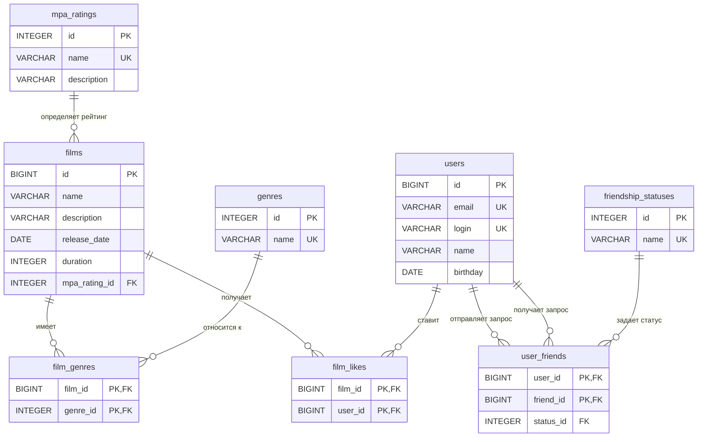

## Визуализация связей (ER-диаграмма)

---

## Описание таблиц

### 1. Таблицы-справочники

#### Таблица `mpa_ratings`
Хранит информацию о возрастных рейтингах Ассоциации кинокомпаний (MPA).
*   `id` (INTEGER, PK): Уникальный идентификатор рейтинга.
*   `name` (VARCHAR, UNIQUE): Короткое название (G, PG, PG-13, R, NC-17).
*   `description` (VARCHAR): Подробное описание возрастного ограничения.

#### Таблица `genres`
Хранит доступные жанры фильмов.
*   `id` (INTEGER, PK): Уникальный идентификатор жанра.
*   `name` (VARCHAR, UNIQUE): Название жанра (Комедия, Драма и др.).

#### Таблица `friendship_statuses`
Хранит возможные статусы связи между друзьями.
*   `id` (INTEGER, PK): Уникальный идентификатор статуса.
*   `name` (VARCHAR, UNIQUE): Название статуса (`UNCONFIRMED` — отправлен запрос, `CONFIRMED` — запрос принят).

---

### 2. Основные сущности

#### Таблица `users`
Содержит информацию о зарегистрированных пользователях.
*   `id` (BIGINT, PK): Уникальный идентификатор пользователя (автоинкремент).
*   `email` (VARCHAR, UNIQUE): Электронная почта.
*   `login` (VARCHAR, UNIQUE): Логин в системе.
*   `name` (VARCHAR): Отображаемое имя (может быть пустым).
*   `birthday` (DATE): Дата рождения.

#### Таблица `films`
Содержит информацию о фильмах.
*   `id` (BIGINT, PK): Уникальный идентификатор фильма (автоинкремент).
*   `name` (VARCHAR): Название фильма.
*   `description` (VARCHAR): Описание фильма (ограничение до 200 символов).
*   `release_date` (DATE): Дата выхода в прокат.
*   `duration` (INTEGER): Продолжительность в минутах (строго больше 0).
*   `mpa_rating_id` (INTEGER, FK): Ссылка на таблицу `mpa_ratings`.

---

### 3. Таблицы связей

#### Таблица `film_genres`
Связывает фильмы с их жанрами. У одного фильма может быть несколько жанров.
*   `film_id` (BIGINT, FK): Ссылка на фильм. При удалении фильма связи удаляются каскадно (`CASCADE`).
*   `genre_id` (INTEGER, FK): Ссылка на жанр.
*   *Первичный ключ:* Составной (`film_id`, `genre_id`), что исключает дублирование одного и того же жанра у фильма.

#### Таблица `film_likes`
Фиксирует лайки пользователей к фильмам.
*   `film_id` (BIGINT, FK): Ссылка на фильм.
*   `user_id` (BIGINT, FK): Ссылка на пользователя, поставившего лайк.
*   *Первичный ключ:* Составной (`film_id`, `user_id`), один пользователь может лайкнуть один фильм только один раз.

#### Таблица `user_friends`
Описывает социальные связи (дружбу) между пользователями.
*   `user_id` (BIGINT, FK): Идентификатор пользователя, который отправил запрос на добавление в друзья.
*   `friend_id` (BIGINT, FK): Идентификатор пользователя, которому адресован запрос.
*   `status_id` (INTEGER, FK): Ссылка на текущий статус дружбы из таблицы `friendship_statuses`.
*   *Первичный ключ:* Составной (`user_id`, `friend_id`).
*   *Ограничения:* Действует проверка `CHECK (user_id <> friend_id)`, запрещающая добавлять в друзья самого себя.

## Схема



## Примеры SQL-запросов для основных операций

### 1. Операции с фильмами и лайками

#### Получение полной информации о фильме по его ID
Запрос собирает данные фильма, включая название его возрастного рейтинга MPA.
```sql
SELECT f.id, 
       f.name, 
       f.description, 
       f.release_date, 
       f.duration, 
       f.mpa_rating_id, 
       m.name AS mpa_name
FROM films AS f
LEFT JOIN mpa_ratings AS m ON f.mpa_rating_id = m.id
WHERE f.id = :film_id;
```

#### Топ-N наиболее популярных фильмов по количеству лайков
Используется для вывода главных хитов.
```sql
SELECT f.id, 
       f.name, 
       f.description, 
       f.release_date, 
       f.duration, 
       f.mpa_rating_id,
       COUNT(fl.user_id) AS likes_count
FROM films AS f
LEFT JOIN film_likes AS fl ON f.id = fl.film_id
GROUP BY f.id
ORDER BY likes_count DESC
LIMIT :limit_value; -- Вместо :limit_value передается число N
```

#### Добавление и удаление лайка
Операции для взаимодействия пользователей с контентом через промежуточную таблицу `film_likes`.
```sql
-- Добавить лайк
INSERT INTO film_likes (film_id, user_id) 
VALUES (:film_id, :user_id);

-- Удалить лайк
DELETE FROM film_likes 
WHERE film_id = :film_id AND user_id = :user_id;
```

---

### 2. Операции с пользователями и дружбой

#### Список друзей пользователя
Запрос выводит всех пользователей, которые добавлены в друзья к указанному юзеру (учитываются как подтвержденные, так и отправленные запросы).
```sql
SELECT u.id, u.email, u.login, u.name, u.birthday
FROM users AS u
JOIN user_friends AS uf ON u.id = uf.friend_id
WHERE uf.user_id = :user_id;
```

#### Список общих друзей между двумя пользователями
Запрос находит пересечение списков друзей для пользователя `:user_id1` и пользователя `:user_id2`.
```sql
SELECT u.id, u.email, u.login, u.name, u.birthday
FROM users AS u
WHERE u.id IN (
    SELECT friend_id FROM user_friends WHERE user_id = :user_id1
) 
AND u.id IN (
    SELECT friend_id FROM user_friends WHERE user_id = :user_id2
);
```

#### Управление статусом дружбы (Бизнес-логика)
Когда `User1` отправляет запрос `User2`, создается запись со статусом `UNCONFIRMED`. Когда `User2` одобряет запрос, статус обновляется на `CONFIRMED`.

```sql
-- Шаг 1: User1 отправляет запрос пользователю User2
INSERT INTO user_friends (user_id, friend_id, status_id) 
VALUES (
    :user_1_id, 
    :user_2_id, 
    (SELECT id FROM friendship_statuses WHERE name = 'UNCONFIRMED')
);

-- Шаг 2: User2 подтверждает дружбу (обновляем статус существующего запроса)
UPDATE user_friends 
SET status_id = (SELECT id FROM friendship_statuses WHERE name = 'CONFIRMED')
WHERE user_id = :user_1_id AND friend_id = :user_2_id;
```
