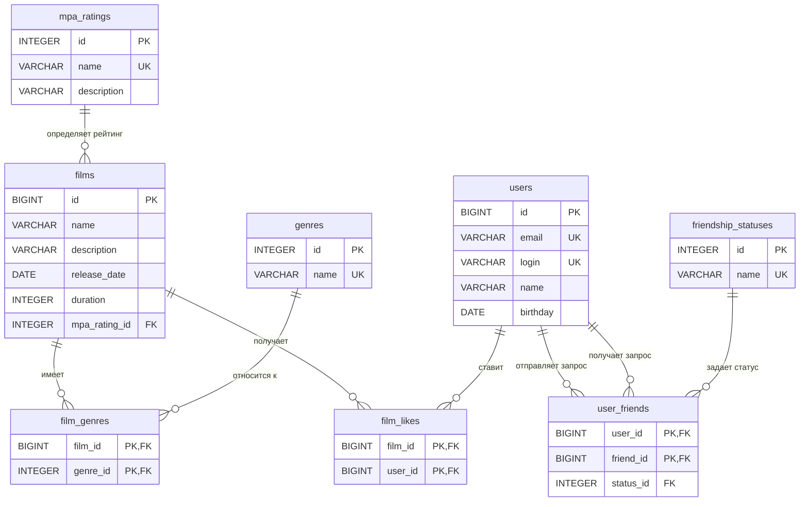

## Визуализация связей (ER-диаграмма)

---

## Описание таблиц

### 1. Таблицы-справочники

#### Таблица `mpa_ratings`
Хранит информацию о возрастных рейтингах Ассоциации кинокомпаний (MPA).
*   `id` (INTEGER, PK): Уникальный идентификатор рейтинга.
*   `name` (VARCHAR, UNIQUE): Короткое название (G, PG, PG-13, R, NC-17).
*   `description` (VARCHAR): Подробное описание возрастного ограничения.

#### Таблица `genres`
Хранит доступные жанры фильмов.
*   `id` (INTEGER, PK): Уникальный идентификатор жанра.
*   `name` (VARCHAR, UNIQUE): Название жанра (Комедия, Драма и др.).

#### Таблица `friendship_statuses`
Хранит возможные статусы связи между друзьями.
*   `id` (INTEGER, PK): Уникальный идентификатор статуса.
*   `name` (VARCHAR, UNIQUE): Название статуса (`UNCONFIRMED` — отправлен запрос, `CONFIRMED` — запрос принят).

---

### 2. Основные сущности

#### Таблица `users`
Содержит информацию о зарегистрированных пользователях.
*   `id` (BIGINT, PK): Уникальный идентификатор пользователя (автоинкремент).
*   `email` (VARCHAR, UNIQUE): Электронная почта.
*   `login` (VARCHAR, UNIQUE): Логин в системе.
*   `name` (VARCHAR): Отображаемое имя (может быть пустым).
*   `birthday` (DATE): Дата рождения.

#### Таблица `films`
Содержит информацию о фильмах.
*   `id` (BIGINT, PK): Уникальный идентификатор фильма (автоинкремент).
*   `name` (VARCHAR): Название фильма.
*   `description` (VARCHAR): Описание фильма (ограничение до 200 символов).
*   `release_date` (DATE): Дата выхода в прокат.
*   `duration` (INTEGER): Продолжительность в минутах (строго больше 0).
*   `mpa_rating_id` (INTEGER, FK): Ссылка на таблицу `mpa_ratings`.

---

### 3. Таблицы связей

#### Таблица `film_genres`
Связывает фильмы с их жанрами. У одного фильма может быть несколько жанров.
*   `film_id` (BIGINT, FK): Ссылка на фильм. При удалении фильма связи удаляются каскадно (`CASCADE`).
*   `genre_id` (INTEGER, FK): Ссылка на жанр.
*   *Первичный ключ:* Составной (`film_id`, `genre_id`), что исключает дублирование одного и того же жанра у фильма.

#### Таблица `film_likes`
Фиксирует лайки пользователей к фильмам.
*   `film_id` (BIGINT, FK): Ссылка на фильм.
*   `user_id` (BIGINT, FK): Ссылка на пользователя, поставившего лайк.
*   *Первичный ключ:* Составной (`film_id`, `user_id`), один пользователь может лайкнуть один фильм только один раз.

#### Таблица `user_friends`
Описывает социальные связи (дружбу) между пользователями.
*   `user_id` (BIGINT, FK): Идентификатор пользователя, который отправил запрос на добавление в друзья.
*   `friend_id` (BIGINT, FK): Идентификатор пользователя, которому адресован запрос.
*   `status_id` (INTEGER, FK): Ссылка на текущий статус дружбы из таблицы `friendship_statuses`.
*   *Первичный ключ:* Составной (`user_id`, `friend_id`).
*   *Ограничения:* Действует проверка `CHECK (user_id <> friend_id)`, запрещающая добавлять в друзья самого себя.

## Схема

